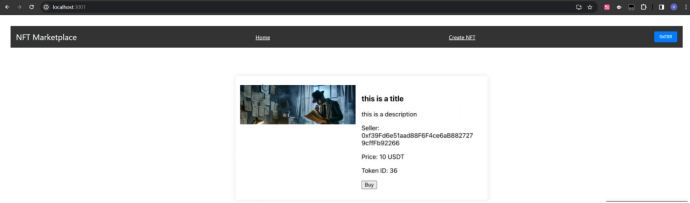

## 前端交互接口设计

> 原项目来自[liangpeili/nft-marketplace-frontend (github.com)](https://github.com/liangpeili/nft-marketplace-frontend)

后端:

\NFT-Marketplace> node app.js

前端:

~~~bash
# 创建react项目
npx create-react-app test2
npm install react-router-dom axios ethers

npx hardhat node
node app.js

npm run start
~~~

合约地址
MyNFT: 

0xe7f1725E7734CE288F8367e1Bb143E90bb3F0512

0xCf7Ed3AccA5a467e9e704C703E8D87F634fB0Fc9

0x9fE46736679d2D9a65F0992F2272dE9f3c7fa6e0

cUSDT: 

0x5FbDB2315678afecb367f032d93F642f64180aa3

0xDc64a140Aa3E981100a9becA4E685f962f0cF6C9

0xe7f1725E7734CE288F8367e1Bb143E90bb3F0512

Market: 

0x9fE46736679d2D9a65F0992F2272dE9f3c7fa6e0

0x5FC8d32690cc91D4c39d9d3abcBD16989F875707

0xCf7Ed3AccA5a467e9e704C703E8D87F634fB0Fc9

备注：不同环境部署出来的合约地址可能不一样，以实际为准

### 购买NFT
0. 查询allowance, 如果为0或者不足，先调用approve
1. 调用 erc20.approve(spender, amount) 批准Market合约转币；
2. 调用 market.buy(tokenId) 购买；

### 挖NFT

前端上传图片，其他步骤在后端完成：
1. 图片上传到 IPFS 并返回 CID；
2. 生成 Metadata 并返回 CID；
3. Mint NFT给用户；

### 改价格

调用 market.changePrice(tokenId, price)

### 下架

调用 market.cancelOrder(tokenId)

### 查询市场所有NFT

调用 market.getAllNFTs()
调用 nft.token(URI)

### 查询个人所有NFT

调用 market.getMyNFTs()
调用 erc721.balanceOf(address)
调用 erc721.tokenOfOwnerByIndex(owner, index)
调用 erc721.tokenURI(tokenId)
